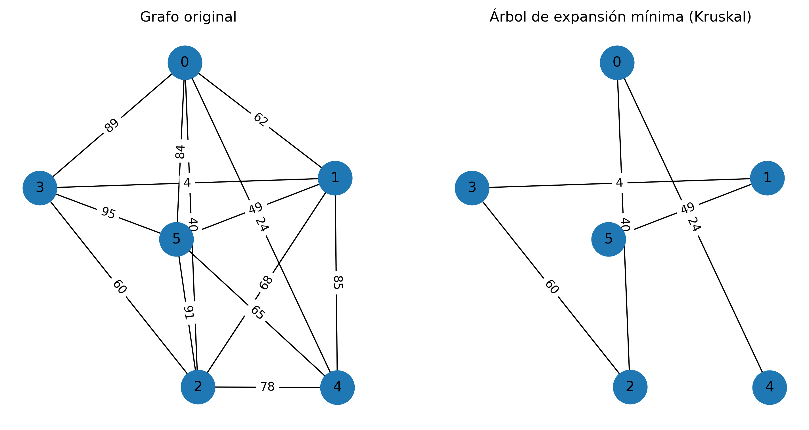
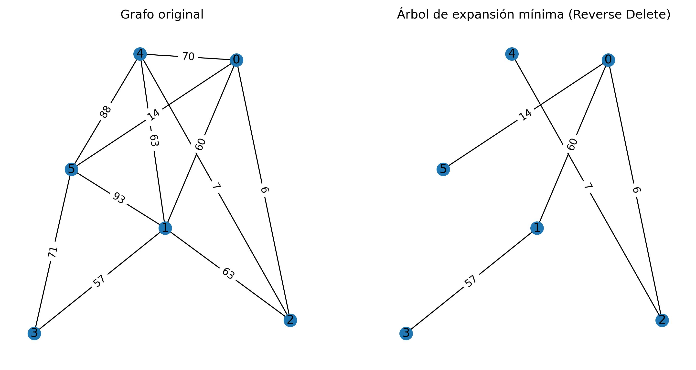
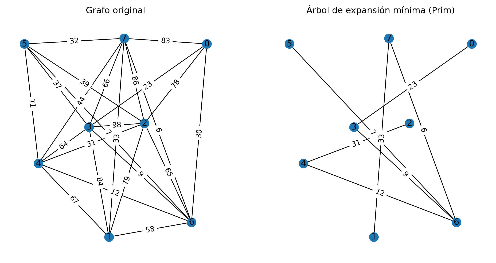

# Teoría de Grafos

Este repositorio contiene implementaciones en Python de algoritmos clásicos de teoría de grafos. Para la generación y manipulación de grafos se utiliza la librería **NetworkX**, y para la visualización de resultados, **Matplotlib**.

Los algoritmos implementados son:

- Generación de grafos r-regulares de orden n.
- Generación de un grafo a partir de una sucesión gráfica.
- Kruskal.
- Kruskal Inverso (Reverse Delete).
- Prim.

Cada algoritmo cuenta con una carpeta de resultados que incluye imágenes del funcionamiento y los resultados obtenidos.

## Instalación

Para ejecutar el proyecto, instala las dependencias necesarias con:

```bash
pip install networkx matplotlib
```

## Metodología de desarrollo

---

### Generación de grafos r-regulares de orden n

Construye grafos en los que todos los `n` vértices tienen exactamente el mismo grado `r`. La construcción se realiza en dos pasos: primero se conecta cada vértice con sus `r//2` vecinos más cercanos en sentido circular; si `r` es impar, se conecta además cada vértice con su nodo opuesto.

Antes de construir el grafo, se verifica la factibilidad de la construcción mediante dos condiciones:

| Condición | Motivo |
|-----------|--------|
| `r < n` | En un grafo simple un vértice no puede conectarse a sí mismo ni repetir aristas, por lo que el grado no puede superar `n - 1`. |
| `r * n` es par | La suma de todos los grados debe ser par, ya que cada arista contribuye 2 al total. |

**Errores que puede lanzar:**

- `ValueError` — si `n ≤ r` o si `r * n` es impar.


---

### Generación de un grafo a partir de una sucesión gráfica

Implementa el **algoritmo de Erdős–Gallai** para determinar si una secuencia de grados es gráfica (es decir, si corresponde a un grafo simple válido) y, de serlo, construye dicho grafo.

El procedimiento es iterativo: en cada paso se ordena la secuencia de mayor a menor, se toma el vértice de mayor grado `d` y se lo conecta con los `d` vértices siguientes, reduciendo en 1 el grado de cada uno. El proceso se repite hasta que todos los grados son 0.

**Valores de retorno:**

- Devuelve el grafo construido si la sucesión es gráfica.
- Devuelve `False` si la sucesión no es válida (grado mayor que los vértices disponibles o grado negativo tras las reducciones).


---

### Kruskal

Obtiene el **árbol generador mínimo (MST)** de un grafo ponderado y conexo. El algoritmo ordena todas las aristas por peso ascendente y las va añadiendo al árbol solo si no forman un ciclo, utilizando una estructura de **conjuntos disjuntos** para detectar esto de forma eficiente.

El proceso termina en cuanto el árbol contiene exactamente `n - 1` aristas, garantizando que conecta todos los vértices con el menor peso total posible.

**Complejidad:** O(E log E), donde E es el número de aristas.



---

### Kruskal Inverso (Reverse Delete)

Variante del algoritmo de Kruskal que opera en sentido contrario: parte del grafo completo y elimina aristas en orden de peso **descendente**, siempre que su eliminación no desconecte el grafo.

Para determinar si una arista es un **puente** (es decir, si su eliminación dividiría el grafo en dos componentes), se realiza una búsqueda en profundidad (DFS) desde uno de sus extremos y se verifica si el otro extremo sigue siendo alcanzable. El resultado final es el mismo árbol generador mínimo que produce Kruskal, pero construido desde el extremo opuesto.

**Complejidad:** O(E² · V) en el peor caso, debido a la verificación de puentes mediante DFS por cada arista.



---

### Prim

Construye el **árbol generador mínimo (MST)** expandiendo progresivamente un conjunto de vértices visitados. En cada iteración se recorren todas las aristas que conectan un vértice visitado con uno no visitado, y se selecciona la de menor peso. El algoritmo lanza una excepción si el grafo no es conexo.

A diferencia de Kruskal, Prim trabaja sobre los vértices y no sobre las aristas, lo que lo hace especialmente eficiente en grafos densos.

**Errores que puede lanzar:**

- `ValueError` — si el grafo no es conexo (no existe arista que conecte el conjunto visitado con el resto).

**Complejidad:** O(V · E) en esta implementación, donde V es el número de vértices y E el de aristas.



---

## Autor

**Alejandro Madrigal**

