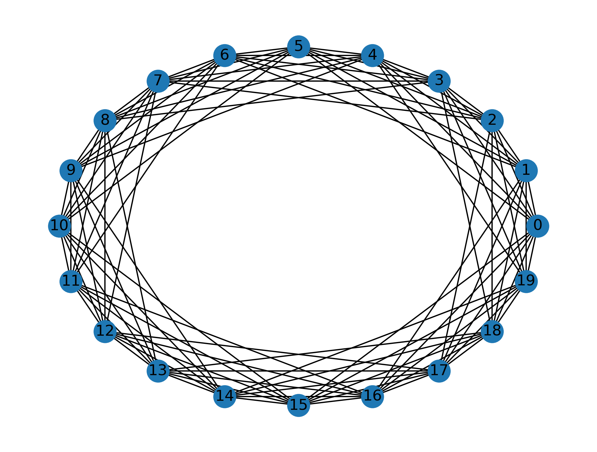
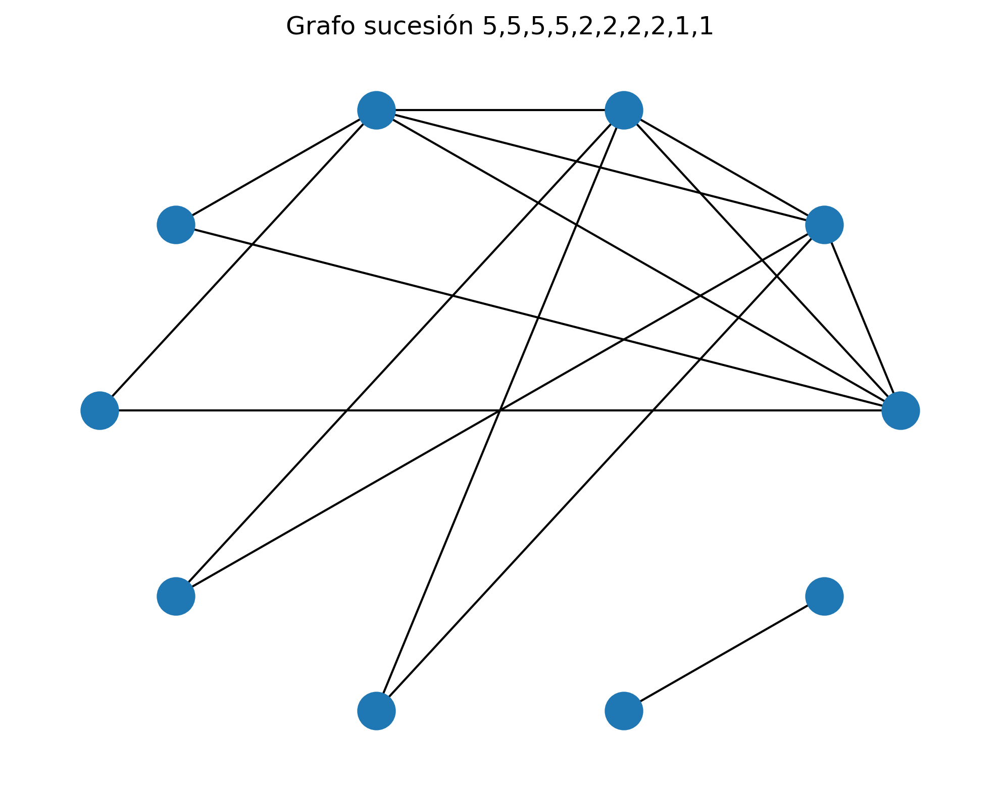

# Teoría de Grafos

Este repositorio contiene la implementación en Python de algoritmos de teoría de grafos. Para la generación y manipulación de grafos se utiliza la librería **NetworkX**, mientras que la visualización de los resultados se realiza mediante **Matplotlib**.

Los algoritmos implementados en este proyecto son:

- Generación de grafos r-regulares de orden n.
- Generación de un grafo a partir de una sucesión gráfica.
- Kruskal.
- Kruskal inverso (Reverse Delete).
- Prim.

Además, para cada algoritmo el repositorio incluye una carpeta con capturas que muestran el funcionamiento y los resultados obtenidos por cada algoritmo.

## Instalación

Para la correcta ejecución del proyecto, es necesario instalar las siguientes dependencias:

```bash
pip install networkx matplotlib
```

## Metodología de desarrollo

En este proyecto, cada algoritmo fue implementado de forma modular, utilizando estructuras de grafos proporcionadas por la librería NetworkX. A continuación se describe de manera breve la función de cada uno de los métodos implementados:

### Generación de grafos r-regulares de orden n

construye grafos en los que todos los n vértices tienen el mismo grado r, verificando previamente la factibilidad de la construcción., es decir que r < n y r*n es par



### Generación de un grafo a partir de una sucesión gráfica

determina si una secuencia de grados es válida y construye un grafo simple que la satisface.



### Kruskal

obtiene un árbol generador mínimo seleccionando iterativamente las aristas de menor peso sin formar ciclos.

### Kruskal inverso (Reverse Delete)
parte del grafo completo y elimina aristas de mayor peso siempre que no desconecten el grafo, hasta obtener un árbol generador mínimo.

### Prim
construye un árbol generador mínimo expandiendo progresivamente un conjunto de vértices, añadiendo siempre la arista de menor peso que conecta con un vértice no incluido.
